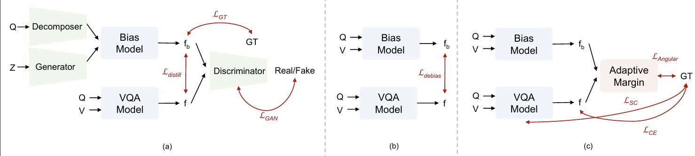
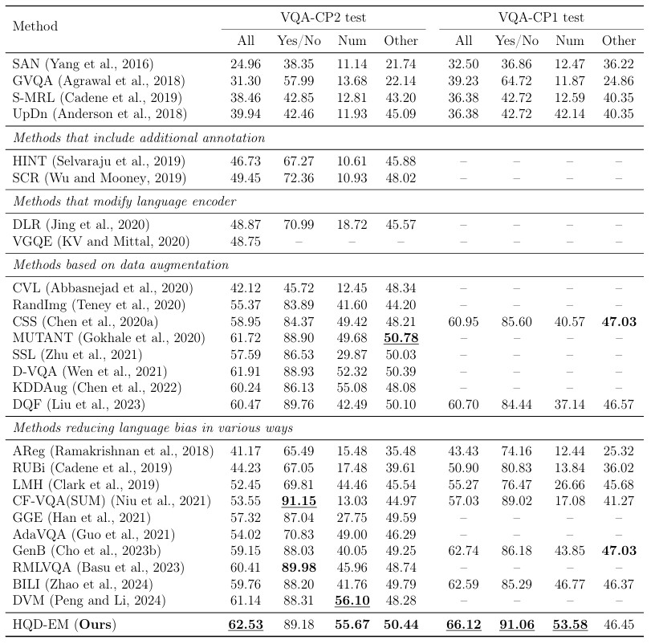

# HQD-EM: Robust VQA with Hierarchical Question Decomposition & Ensemble Margin

For the best performing model, you can download our best performing model from 
Best model: Download here (https://drive.google.com/drive/folders/1-aADgu93SDutxhjZQpT5ARD_a6msxSNS?usp=drive_link)

# Model Architecture

  
 

Key ideas

HQD (Hierarchical Question Decomposition): Decomposes complex questions into sub-queries (e.g., subject → attribute → relation) to mitigate language bias.

EM (Ensemble + Margin): Ensembles models with different backbones/training seeds and expands the decision boundary using an Adaptive Angular Margin.

# Results
Table on VQA CP2

  
 

You can see that our model outperforms other methods overall; in particular, it achieves strong results on the challenging Num and Other categories.
